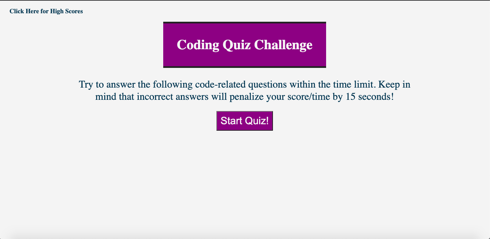
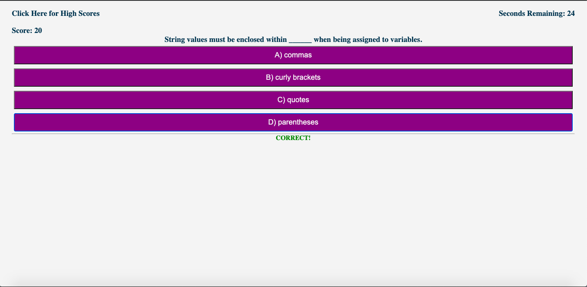
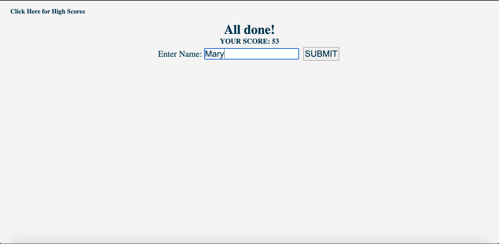
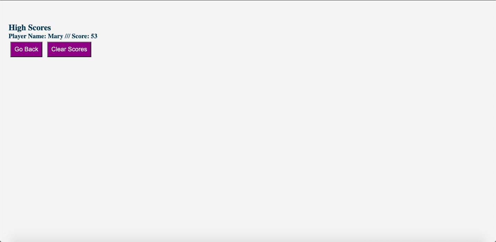

# JavaScript Code Quiz
Timed, multiple-choice, JavaScript coding quiz for the developing developer!

---

## Description

A JavaScript coding quiz featuring dynamically modified HTML. Runs in the browser and uses DOM manipulation and data preservation to keep track of player scores.

---

## Table of Contents
* [Installation](#Installation)
* [Usage](#Usage)
* [Images](#Images)
* [Credits](#Credits)
* [Collaborators](#Collaborators)
* [License](#License)

---

## Installation

1. Clone the Github Repository [here](https://github.com/jameygronewald/javascriptCodeQuiz).
2. Open index.html in browser.

---

## Usage

* Visit the deployed app: [JavaScript Code Quiz](https://jameygronewald.github.io/javascriptCodeQuiz/)
    1. Click the Start button to begin quiz.
    2. Select the button that represents the multiple-choice response that best answers the question. If correct, receive 20 points; if incorrect, timer drops by 10 seconds.
    3. After final question, see final score displayed on the screen (base score + time remaining). Enter your name or initials and click submit to see your new score displayed among the high scores.
    4. Hit clear to clear out the high scores, or back to return to the welcome screen and play again!

* Visit Github to track changes that were made or to clone the repo: [Github Repo](https://github.com/jameygronewald/javascriptCodeQuiz).
---

## Images

---

## Credits

Thanks to GT Coding Bootcamp for providing a concept template for the quiz.

---

## Collaborators

I, Jamey Gronewald, was the sole collaborator on this project.

---

## License

MIT License

Copyright (c) [2020] [Jamey Gronewald]

Permission is hereby granted, free of charge, to any person obtaining a copy
of this software and associated documentation files (the "Software"), to deal
in the Software without restriction, including without limitation the rights
to use, copy, modify, merge, publish, distribute, sublicense, and/or sell
copies of the Software, and to permit persons to whom the Software is
furnished to do so, subject to the following conditions:

The above copyright notice and this permission notice shall be included in all
copies or substantial portions of the Software.

THE SOFTWARE IS PROVIDED "AS IS", WITHOUT WARRANTY OF ANY KIND, EXPRESS OR
IMPLIED, INCLUDING BUT NOT LIMITED TO THE WARRANTIES OF MERCHANTABILITY,
FITNESS FOR A PARTICULAR PURPOSE AND NONINFRINGEMENT. IN NO EVENT SHALL THE
AUTHORS OR COPYRIGHT HOLDERS BE LIABLE FOR ANY CLAIM, DAMAGES OR OTHER
LIABILITY, WHETHER IN AN ACTION OF CONTRACT, TORT OR OTHERWISE, ARISING FROM,
OUT OF OR IN CONNECTION WITH THE SOFTWARE OR THE USE OR OTHER DEALINGS IN THE
SOFTWARE.